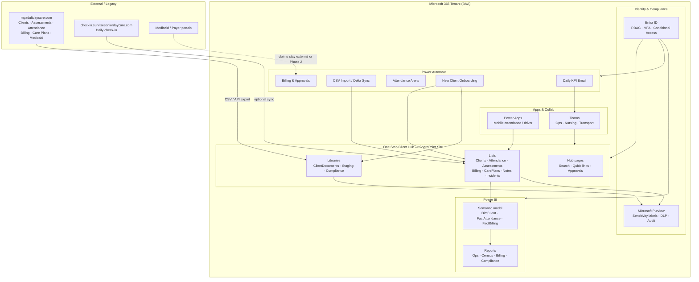

# 1. High-level architecture — One Stop Client Hub

## Decision summary

| Layer | Choice | Why |
|-------|--------|-----|
| Structured data (Phase 1) | SharePoint Lists | Fast to stand up, works with M365 licenses already in play |
| Documents | SharePoint Document Libraries | Versioning, search, sensitivity labels, approvals |
| Automation | Power Automate (cloud flows) | New-client provisioning, imports, alerts, approvals |
| Analytics | Power BI (Import or DirectQuery to Lists) | Attendance, census, billing, compliance |
| Mobile | Power Apps canvas app + Teams | Drivers / floor staff on phones |
| Optional Phase 2 | Dataverse | Stronger relationships, role-based security, large volume |

**Do not** store Medicaid IDs, DOBs, or clinical notes in Teams chat, personal OneDrive, or unlabelled libraries.

---

## Architecture diagram



---

## Logical components

### 1. SharePoint site collection: `OneStopClientHub`

- **Hub site** associated with Sunrise intranet (optional).
- **Lists** hold structured PHI (column-level minimal exposure via views + audience targeting).
- **Libraries** hold assessments PDFs, consents, care plans, ID scans (labelled **Confidential – PHI**).
- **Staging** library: import drop-zone; short retention; restricted to Admins + Integration account.

### 2. Power Automate

- Service account / managed identity with least privilege.
- Never email full PHI in flow notifications — link to SharePoint item only.
- Approval flows for care-plan changes and high-dollar billing adjustments.

### 3. Power BI

- Workspace: `Sunrise - Client Hub Analytics` (Pro or Premium per user).
- Row-level security (RLS) by **Center** (Denver / Houston) and role.
- Dataset refresh: 4–8× daily for ops; nightly full for finance.

### 4. Power Apps (mobile)

- Thin apps over Lists: attendance mark, incident quick-log, driver pickup list.
- Offline-capable where needed for transport.

### 5. Integration patterns

| Pattern | When to use |
|---------|-------------|
| **One-time CSV import** | Initial migration from myadultdaycare.com |
| **Nightly Power Automate** | Delta files dropped to Staging |
| **Azure Data Factory** | Only if API volume is large or multi-system ELT needed later |
| **Manual dual-entry freeze** | Short parallel-run window, then cutover |

---

## Environment topology

```
Tenant
 └── Entra security groups
      ├── SG-ClientHub-Admins
      ├── SG-ClientHub-Nursing
      ├── SG-ClientHub-Billing
      ├── SG-ClientHub-Drivers
      ├── SG-ClientHub-FrontDesk
      └── SG-ClientHub-Leadership-RO
 └── SharePoint: /sites/OneStopClientHub
 └── Power BI workspace
 └── Power Automate solutions (Dev → Prod)
```

**Recommendation:** Use a **Power Platform solution** (`SunriseClientHub`) so flows/apps move Dev → Prod cleanly.

---

## Data classification zones

| Zone | Examples | Controls |
|------|----------|----------|
| Restricted PHI | Medicaid ID, DOB, diagnosis, clinical notes | Label + limited groups + audit |
| Internal ops | Attendance counts, census, transport routes | Staff groups; no public links |
| Aggregates | Occupancy %, cost/client-day | Leadership; OK in KPI email |

---

## Non-goals (Phase 1)

- Full EHR replacement of myadultdaycare.com clinical charting on day one
- Automated Medicaid claim submission (unless billing team confirms)
- Family-facing portal (Phase 3 candidate)
