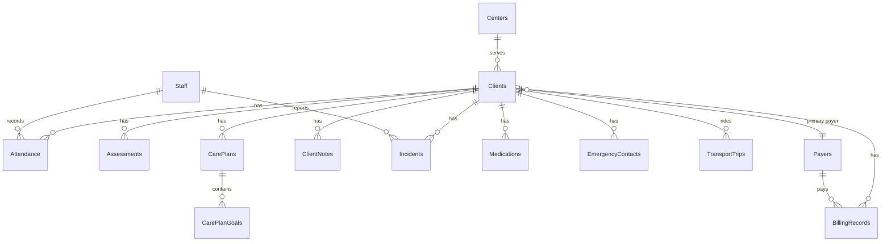

# 2. Detailed data model

Phase 1 stores structured data in **SharePoint Lists**. Phase 2 can promote core entities to **Dataverse** without changing document libraries.

Primary keys: use a stable **`ClientNumber`** (business key from myadultdaycare.com) plus SharePoint `ID` / Dataverse GUID.

---

## Entity-relationship overview

---

## Lists / tables

### `Centers`

| Column | Type | Notes |
|--------|------|-------|
| Title | Single line | e.g. Sunrise Denver, Autumn Houston |
| CenterCode | Single line | `DEN`, `HOU` — unique |
| Address | Multiple lines | |
| Phone | Single line | |
| TimeZone | Choice | Mountain / Central |
| Active | Yes/No | |

---

### `Clients` (core PHI)

| Column | Type | Notes |
|--------|------|-------|
| Title | Single line | Display name: `Last, First` |
| ClientNumber | Single line | **Business key** from myadultdaycare.com — indexed, unique |
| FirstName | Single line | |
| LastName | Single line | |
| PreferredName | Single line | |
| DateOfBirth | Date | Sensitivity: PHI |
| Gender | Choice | |
| Status | Choice | Active / OnHold / Discharged / Prospective |
| Center | Lookup → Centers | |
| EnrollmentDate | Date | |
| DischargeDate | Date | |
| MedicaidID | Single line | PHI — restrict view |
| MedicareID | Single line | Optional |
| PrimaryPayer | Lookup → Payers | |
| SecondaryPayer | Lookup → Payers | |
| DiagnosisPrimary | Multiple lines | Or link to coded list |
| Allergies | Multiple lines | |
| DietaryNeeds | Multiple lines | |
| MobilityLevel | Choice | Independent / Assist / Wheelchair / etc. |
| PhotoConsent | Yes/No | |
| PrimaryLanguage | Choice | |
| AddressLine1 | Single line | |
| City | Single line | |
| State | Single line | |
| PostalCode | Single line | |
| Phone | Single line | |
| Email | Single line | Rare for ADC clients |
| PhysicianName | Single line | |
| PhysicianPhone | Single line | |
| CaseManager | Single line | |
| CaseManagerPhone | Single line | |
| AuthorizedDays | Choice (multi) | Mon–Sun |
| AuthorizedHoursPerDay | Number | |
| TransportNeeded | Yes/No | |
| TransportNotes | Multiple lines | |
| SourceSystemId | Single line | myadultdaycare.com internal ID |
| DocumentFolderUrl | Hyperlink | Set by onboarding flow |
| LastSyncedAt | DateTime | Import watermark |
| NotesSummary | Multiple lines | Non-clinical summary only |

**Views:** `Active Clients`, `By Center`, `Transport Today`, `Billing — Medicaid IDs` (Admin/Billing only).

---

### `EmergencyContacts`

| Column | Type | Notes |
|--------|------|-------|
| Title | Single line | Contact name |
| Client | Lookup → Clients | Required |
| Relationship | Choice | Spouse / Child / Guardian / Other |
| PhonePrimary | Single line | |
| PhoneSecondary | Single line | |
| Email | Single line | |
| IsPrimary | Yes/No | |
| CanPickup | Yes/No | |
| Priority | Number | 1 = first call |

---

### `Attendance`

| Column | Type | Notes |
|--------|------|-------|
| Title | Single line | Auto: `{ClientNumber}-{YYYY-MM-DD}` |
| Client | Lookup → Clients | |
| ClientNumber | Single line | Denormalized for reporting |
| AttendanceDate | Date | Indexed |
| Center | Lookup → Centers | |
| Status | Choice | Present / Absent / Excused / Holiday / Partial |
| CheckInTime | DateTime | |
| CheckOutTime | DateTime | |
| HoursAttended | Number | Decimal |
| MealProvided | Yes/No | |
| TransportIn | Yes/No | |
| TransportOut | Yes/No | |
| RecordedBy | Person | |
| Source | Choice | Manual / CheckInApp / Import |
| SourceSystemId | Single line | |
| Notes | Multiple lines | |

**Unique constraint (logical):** ClientNumber + AttendanceDate.

---

### `Assessments`

| Column | Type | Notes |
|--------|------|-------|
| Title | Single line | e.g. Initial Nursing Assessment |
| Client | Lookup → Clients | |
| AssessmentType | Choice | Initial / Annual / Nursing / OT / PT / Social / Other |
| AssessmentDate | Date | |
| Assessor | Person or text | |
| ScoreOrLevel | Single line | Free text / scale |
| NextDueDate | Date | Compliance |
| Status | Choice | Draft / Final / Archived |
| DocumentLink | Hyperlink | File in ClientDocuments |
| Summary | Multiple lines | |
| SourceSystemId | Single line | |

---

### `CarePlans`

| Column | Type | Notes |
|--------|------|-------|
| Title | Single line | |
| Client | Lookup → Clients | |
| EffectiveDate | Date | |
| ReviewDate | Date | |
| Status | Choice | Draft / PendingApproval / Active / Expired |
| Author | Person | |
| ApprovedBy | Person | |
| ApprovedDate | Date | |
| DocumentLink | Hyperlink | |
| Summary | Multiple lines | |
| SourceSystemId | Single line | |

### `CarePlanGoals`

| Column | Type | Notes |
|--------|------|-------|
| Title | Single line | Goal statement |
| CarePlan | Lookup → CarePlans | |
| Client | Lookup → Clients | Denormalized |
| Domain | Choice | ADLs / Social / Cognitive / Health / Other |
| TargetDate | Date | |
| Status | Choice | NotStarted / InProgress / Met / Discontinued |
| ProgressNotes | Multiple lines | |

---

### `BillingRecords`

| Column | Type | Notes |
|--------|------|-------|
| Title | Single line | Invoice / claim reference |
| Client | Lookup → Clients | |
| ClientNumber | Single line | |
| ServiceDate | Date | |
| BillingPeriodStart | Date | |
| BillingPeriodEnd | Date | |
| Payer | Lookup → Payers | |
| ServiceCode | Single line | HCPCS / local code |
| Units | Number | |
| UnitRate | Currency | |
| Amount | Currency | |
| Status | Choice | Draft / Ready / Submitted / Paid / Denied / Adjusted |
| ClaimNumber | Single line | |
| DenialReason | Multiple lines | |
| PaidDate | Date | |
| PaidAmount | Currency | |
| Center | Lookup → Centers | |
| SourceSystemId | Single line | |
| Notes | Multiple lines | |

---

### `Payers`

| Column | Type | Notes |
|--------|------|-------|
| Title | Single line | Medicaid CO / Medicaid TX / Private / VA … |
| PayerType | Choice | Medicaid / Medicare / Private / Other |
| PayerCode | Single line | |
| Active | Yes/No | |

---

### `ClientNotes`

| Column | Type | Notes |
|--------|------|-------|
| Title | Single line | Short subject |
| Client | Lookup → Clients | |
| NoteDate | DateTime | |
| NoteType | Choice | Clinical / Behavioral / Family / Ops / Billing |
| Body | Multiple lines | PHI |
| Author | Person | |
| IsConfidential | Yes/No | Extra restrict |
| SourceSystemId | Single line | |

---

### `Incidents`

| Column | Type | Notes |
|--------|------|-------|
| Title | Single line | |
| Client | Lookup → Clients | Optional if visitor/staff |
| IncidentDate | DateTime | |
| Location | Choice | Facility / Transport / Community / Other |
| IncidentType | Choice | Fall / Seizure / Elopement / MedError / Injury / Other |
| Severity | Choice | Low / Medium / High / Critical |
| Description | Multiple lines | |
| ImmediateAction | Multiple lines | |
| ReportedBy | Person | |
| Witnesses | Multiple lines | |
| FamilyNotified | Yes/No | |
| FamilyNotifiedAt | DateTime | |
| RegulatoryReportRequired | Yes/No | |
| FollowUpStatus | Choice | Open / InProgress / Closed |
| DocumentFolderUrl | Hyperlink | |
| LinkedSOP | Hyperlink | |

---

### `Medications` (optional Phase 1.5)

| Column | Type | Notes |
|--------|------|-------|
| Title | Single line | Medication name |
| Client | Lookup → Clients | |
| Dose | Single line | |
| Route | Choice | |
| Frequency | Single line | |
| Prescriber | Single line | |
| StartDate | Date | |
| EndDate | Date | |
| Active | Yes/No | |
| AdministrationNotes | Multiple lines | |

---

### `TransportTrips`

| Column | Type | Notes |
|--------|------|-------|
| Title | Single line | Route + date |
| TripDate | Date | |
| Direction | Choice | Pickup / Dropoff |
| Driver | Person or text | |
| VehicleId | Single line | |
| Client | Lookup → Clients | |
| ScheduledTime | DateTime | |
| ActualTime | DateTime | |
| Miles | Number | |
| Status | Choice | Scheduled / Completed / NoShow / Cancelled |
| Notes | Multiple lines | |

---

### `Staff` (optional; or use Entra only)

| Column | Type | Notes |
|--------|------|-------|
| Title | Single line | Display name |
| EntraUser | Person | |
| Role | Choice | Nursing / Driver / Aide / Admin / Kitchen / Activities |
| Center | Lookup → Centers | |
| Active | Yes/No | |

---

### `ImportLog` (ops)

| Column | Type | Notes |
|--------|------|-------|
| Title | Single line | Job name + timestamp |
| Entity | Choice | Clients / Attendance / Billing / … |
| FileName | Single line | |
| RowsRead | Number | |
| RowsSucceeded | Number | |
| RowsFailed | Number | |
| StartedAt | DateTime | |
| CompletedAt | DateTime | |
| Status | Choice | Running / Success / Failed / Partial |
| ErrorSummary | Multiple lines | |

---

## Dataverse mapping (Phase 2)

| SharePoint List | Dataverse Table | Publisher prefix example |
|-----------------|-----------------|--------------------------|
| Clients | crsun_client | `crsun_` |
| Attendance | crsun_attendance | |
| Assessments | crsun_assessment | |
| CarePlans | crsun_careplan | |
| BillingRecords | crsun_billingrecord | |
| Incidents | crsun_incident | |

Keep **document libraries in SharePoint**; store only URL references in Dataverse.

---

## Relationship rules

1. **Clients** is the hub; every child row must have Client lookup (or ClientNumber for import staging).
2. Soft-delete: use `Status = Discharged` / `Active = No` — do not hard-delete PHI without retention policy.
3. Lookups use **ClientNumber** in import scripts; resolve to SharePoint ID after Clients load.
4. Documents are **not** list attachments for PHI — use ClientDocuments library folders for search + labels + versioning.

---

## Indexing & list thresholds

- Index: `ClientNumber`, `AttendanceDate`, `Status`, `Center`, `ServiceDate`.
- If Attendance exceeds ~5,000 items/view, use filtered indexed views by date + archive prior years to `Attendance_Archive_YYYY`.
- For >50k attendance rows/year, prefer Dataverse or Azure SQL for the fact table and keep Lists for operational UI only.
