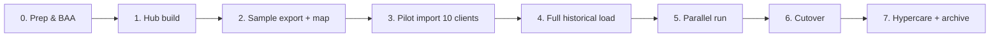

# 3. Migration plan — myadultdaycare.com → One Stop Client Hub

## Objectives

1. Move **clients, assessments, attendance, billing, notes, Medicaid IDs, DOBs, care plans, and documents** into M365 with HIPAA-grade controls.
2. Preserve **SourceSystemId** for audit and dual-run reconciliation.
3. Cut over with measurable validation (row counts, sample audits, financial totals).

---

## Phases overview

---

## Phase 0 — Prerequisites (IT / Compliance)

- [ ] Confirm Microsoft **Business Associate Agreement (BAA)** for the tenant.
- [ ] Enable MFA + Conditional Access for all staff.
- [ ] Turn on Purview **Audit (Standard/Premium)** and retention for SharePoint/OneDrive.
- [ ] Create sensitivity label **Confidential – PHI** (encrypt + block external sharing).
- [ ] Create Entra groups: Admins, Nursing, Billing, Drivers, FrontDesk, Leadership-RO.
- [ ] Designate **migration service account** (no interactive daily use; MFA + PATs as needed).
- [ ] Identify myadultdaycare.com export capabilities (CSV modules, date ranges, document zip).

**Exit criteria:** BAA signed, labels publishable, groups exist, sample export obtained.

---

## Phase 1 — Build Hub

1. Create site `/sites/OneStopClientHub` (see PnP script).
2. Provision lists from schemas in `schemas/`.
3. Create libraries + folder tree (`docs/07-sharepoint-folders.md`).
4. Apply permissions (break inheritance on Staging + Billing views as needed).
5. Deploy ImportLog list and empty Power Automate solutions.
6. Create Power BI workspace (empty semantic model).

**Exit criteria:** Empty Hub ready; security smoke-tested with test users per role.

---

## Phase 2 — Export from myadultdaycare.com

### Preferred export order

| Order | Entity | Typical export | Notes |
|------:|--------|----------------|-------|
| 1 | Centers / Locations | Manual seed | Small |
| 2 | Payers | Manual or CSV | |
| 3 | Clients | CSV | Include Medicaid ID, DOB, status, address |
| 4 | Emergency contacts | CSV | |
| 5 | Assessments | CSV + PDF zip | Link files after upload |
| 6 | Care plans | CSV + PDF zip | |
| 7 | Attendance | CSV by month/year | Largest volume |
| 8 | Billing | CSV | Reconcile totals |
| 9 | Notes | CSV | |
| 10 | Medications | CSV | If used |
| 11 | Documents (misc) | Zip / per-client | Consents, IDs, MD orders |

### Export tips

- Export **UTF-8 CSV** with header row.
- Include a stable ID column from myadultdaycare.com on every file.
- For attendance/billing, export in **monthly chunks** to stay under flow/file limits.
- Store raw exports in `01-Staging/Imports/raw/YYYY-MM-DD/` — **read-only after checksum**.
- Record file SHA-256 in ImportLog or a simple checklist.

### If UI-only (no bulk export)

1. Use browser export per report/module.
2. Escalate to vendor support for bulk data extract (cite HIPAA right of access / business need).
3. As last resort, controlled screen-scrape is **not** recommended for PHI — prefer vendor extract.

Field mapping templates: [`../migration/field-maps/`](../migration/field-maps/).

---

## Phase 3 — Transform & map

1. Copy raw → `working/` and normalize column names to Hub schema.
2. Apply transforms:
   - Dates → ISO `YYYY-MM-DD`
   - Status enums → Hub choices
   - Phone → `E.164` or consistent `###-###-####`
   - ClientNumber uniqueness check
   - Deduplicate contacts
3. Produce load-ready CSVs in `ready/`:
   - `clients_ready.csv`
   - `attendance_ready_YYYYMM.csv`
   - etc.
4. Run validation script [`../migration/scripts/Validate-ImportCsv.ps1`](../migration/scripts/Validate-ImportCsv.ps1).

**Exit criteria:** Zero critical validation errors; warnings reviewed.

---

## Phase 4 — Pilot (10 clients)

1. Select 10 diverse clients (active, discharged, transport, Medicaid, private).
2. Import Clients → Contacts → Assessments → CarePlans → Attendance (90 days) → Billing (90 days) → Notes.
3. Upload documents into `ClientDocuments/{ClientNumber}/…`.
4. Run onboarding flow manually for 1 new fake client to test automation.
5. **Reconciliation checklist:**
   - [ ] Name, DOB, Medicaid ID match source
   - [ ] Attendance day counts match (±0)
   - [ ] Billing amounts match within $0.01
   - [ ] Assessment PDF opens with correct label
   - [ ] Wrong-role user cannot see Medicaid view

**Exit criteria:** Sign-off from Joe (or Grace) + Billing + Nursing on pilot packet.

---

## Phase 5 — Full load

1. Freeze source changes during load window **or** capture watermark (`LastModified`) for delta.
2. Load order: Centers → Payers → Clients → children → Attendance → Billing → Notes → Documents.
3. Tools:
   - **PnP PowerShell** / Graph for bulk list items (preferred for large attendance).
   - **Power Automate** for smaller entities and ongoing deltas.
   - Optional **Azure Data Factory** if multi-GB or recurring API sync later.
4. After each entity: write ImportLog + row-count reconcile.
5. Build Power BI dataset; validate KPI totals vs myadultdaycare.com reports.

---

## Phase 6 — Parallel run (recommended 2–4 weeks)

| System | Role during parallel |
|--------|----------------------|
| myadultdaycare.com | System of record for clinical/billing until cutover |
| Client Hub | Read + limited write (attendance pilot, docs) |
| Nightly delta | Optional attendance/billing refresh into Hub |

Daily reconcile: census, attendance present-count, billing draft totals.

---

## Phase 7 — Cutover

1. Announce freeze time (e.g. Friday 6pm).
2. Final delta export → import.
3. Flip Hub lists to **read-write** for production roles.
4. Set myadultdaycare.com to **read-only** (or continue as secondary if vendor still required for claims).
5. Update SOPs and Teams links.
6. Hypercare 10 business days: daily ImportLog review, issue triage channel.

---

## Phase 8 — Archive & decommission

- Keep raw export package in Staging archive with retention (e.g. 7 years per state rules — confirm CO/TX).
- Document legal hold process.
- Do not delete myadultdaycare.com access until counsel/compliance confirms retention satisfied.

---

## Import strategy matrix

| Volume | Method |
|--------|--------|
| < 2,000 rows / entity | Power Automate (parse CSV → create items) |
| 2,000–50,000 rows | PnP PowerShell batch add |
| Recurring API | Power Automate scheduled + watermark |
| Complex multi-source ELT | Azure Data Factory → SharePoint/Dataverse |

---

## Rollback

1. Keep pre-cutover Hub snapshot (site backup / list export).
2. If critical defect: revert staff to myadultdaycare.com; Hub → read-only.
3. Fix data; re-run delta; re-attempt cutover.

---

## RACI (suggested)

| Activity | Joe | Grace | Andy / Ops Tech | Billing | Nursing | Zen-S / IT |
|----------|-----|-------|-----------------|---------|---------|------------|
| Approvals / cutover | A | C | R | C | C | C |
| Exports | I | C | R | C | C | C |
| Hub build | I | I | R | I | I | A/C |
| Validation | A | R | R | R | R | C |
| Security labels | A | I | C | I | I | R |
