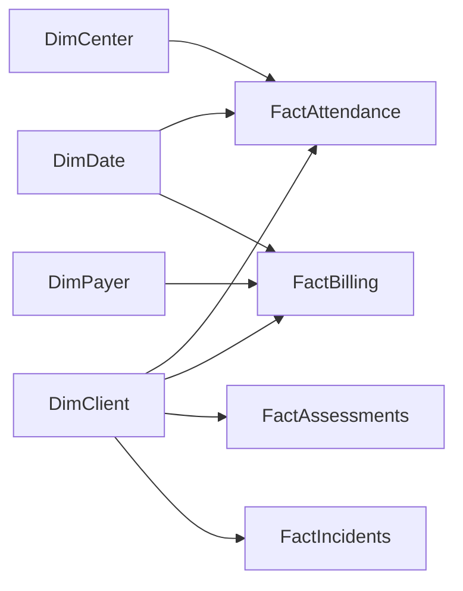

# 5. Power BI report structure

**Workspace:** `Sunrise - Client Hub Analytics`  
**Dataset:** `ClientHub_SemanticModel` (Import mode from SharePoint Lists; DirectQuery only if needed)

Aligns with Andy roadmap KPIs: Occupancy %, Cost per Client-Day, Labor %, Transport Utilization, Referral Conversion.

---

## Semantic model

### Tables

| Table | Grain | Source list |
|-------|-------|-------------|
| DimDate | Day | Generated |
| DimCenter | Center | Centers |
| DimClient | Client | Clients (minimize columns in reports) |
| DimPayer | Payer | Payers |
| FactAttendance | Client-day | Attendance |
| FactBilling | Claim/line | BillingRecords |
| FactAssessments | Assessment | Assessments |
| FactIncidents | Incident | Incidents |
| FactTransport | Trip | TransportTrips |

**RLS roles:** `Center_DEN`, `Center_HOU`, `Leadership_All`.

---

## Report pages

### Page 1 — Executive Ops (daily)

| Visual | Type | Notes |
|--------|------|-------|
| Census today | Card | Active clients |
| Present today | Card | |
| Occupancy % | Card + sparkline | Present / capacity |
| Attendance trend (28d) | Line | Present count |
| By center | Clustered bar | If multi-site |
| Open critical incidents | Card | |
| Assessments overdue | Card | NextDueDate < today |

Slicers: Center, Date.

### Page 2 — Attendance & Census

| Visual | Type |
|--------|------|
| Heatmap weekday × week | Matrix |
| Hours attended distribution | Histogram |
| Absence reasons | Donut (Status) |
| Authorized vs actual days | Bar |
| Client detail table | Table (role-restricted) |

### Page 3 — Billing & Revenue

| Visual | Type |
|--------|------|
| Billed vs Paid MTD | Cards |
| Aging by status | Stacked bar |
| Amount by payer | Treemap / bar |
| Denial rate | Card + trend |
| Cost per client-day | Card |
| Service units trend | Line |

**Do not** put Medicaid IDs on this page — ClientNumber only if needed for finance role.

### Page 4 — Transport

| Visual | Type |
|--------|------|
| Trips completed vs scheduled | Cards |
| Miles by day | Line |
| Utilization % | Card |
| No-show rate | Card |
| Driver volume | Bar |

### Page 5 — Compliance

| Visual | Type |
|--------|------|
| Assessments due in 30/60/90 | Stacked bar |
| Care plans pending approval | Card + table |
| Incident counts by type | Bar |
| Regulatory flags open | Table |
| Training / SOP acknowledgment | Optional later |

### Page 6 — Referrals & Enrollment (if data available)

| Visual | Type |
|--------|------|
| Prospective → Active conversion | Funnel |
| Enrollment by month | Column |
| Discharge reasons | Bar |

---

## Core DAX (see `power-bi/dax/measures.dax`)

- `Occupancy Pct`
- `Cost Per Client Day`
- `Labor Pct` (requires labor cost input table or manual KPI list)
- `Transport Utilization`
- `Referral Conversion`
- `Present Count`
- `Authorized Client Days`
- `Billing Denial Rate`

---

## Refresh & distribution

| Item | Cadence |
|------|---------|
| Dataset refresh | 6:30am, 11am, 3pm local |
| App | Publish Power BI App to Leadership + Ops |
| Teams | Pin Executive Ops page in Ops channel |
| Email | PA-08 uses aggregated KPIs (not full report PHI) |

---

## PHI hygiene in Power BI

1. Exclude MedicaidID, full address, note bodies from import unless in a **Finance-secure** report.
2. Use **sensitivity label** on the .pbix / dataset.
3. Disable “share publicly” / build permissions for broad audiences.
4. Prefer aggregated pages for general staff; detail tables for Nursing/Billing only.
